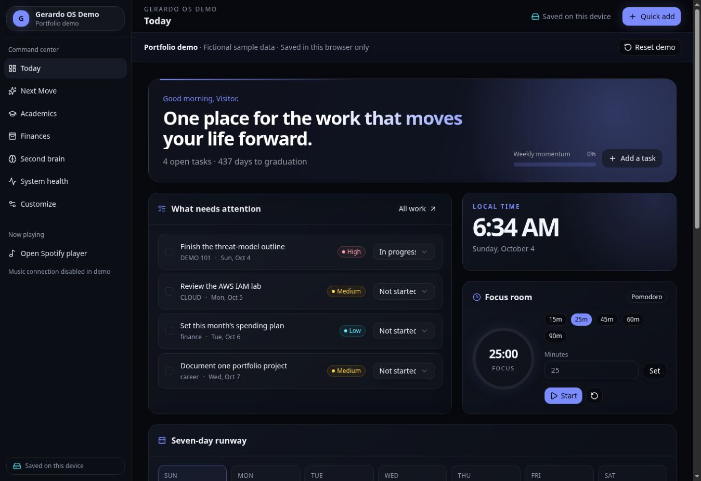
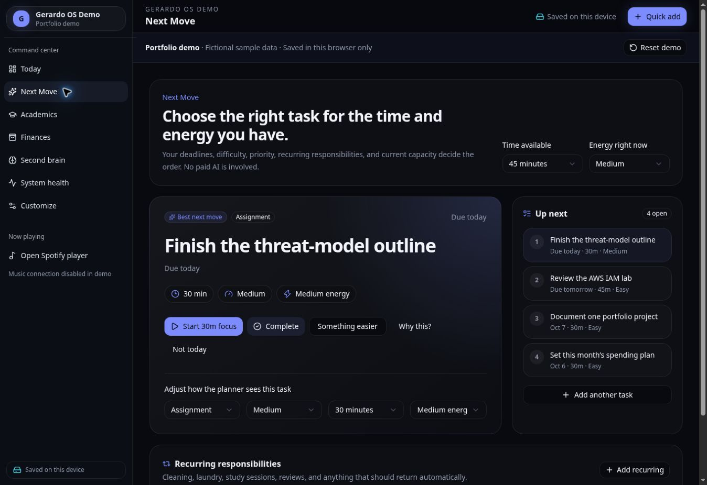
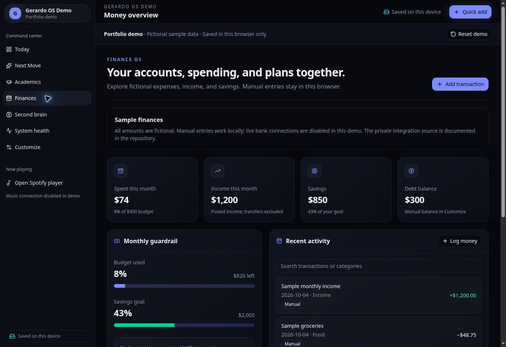

# Gerardo OS

This is my personal dashboard project. It brings tasks, classes, a focus timer, notes, and finances into one place.

This repository is a separate demo. All data is fictional, and changes are saved in the browser. My private OS and accounts are not connected.

## Screenshots

### Today

The home page shows sample tasks, a focus timer, and upcoming deadlines.



### Next Move

The planner suggests a task based on its deadline, difficulty, estimated time, and the time and energy available. This uses ranking rules, not an AI service.



### Finances

These amounts are sample data. Manual entries work, but live bank connections are disabled.



## What it can do

- Add and complete tasks, with a 12-hour undo period.
- Suggest what to work on next.
- Start, pause, and reset a focus timer.
- Keep sample courses, habits, notes, and manual expenses.
- Change the accent color and layout density.
- Reset the demo to its starting data.

## Tools used

React, TypeScript, Vite, Tailwind CSS, and browser localStorage.

The repository also keeps reference code for the private app's Cloudflare Worker, D1 database, Canvas imports, Plaid connection, and Spotify controls. Those integrations are not running in this demo.

## Run locally

Use Node.js 22.13 or newer.

```bash
npm ci
npm run dev
```

Open the address Vite prints. No API keys or sign-in are needed.

## Checks

```bash
npm run typecheck
npm run test:integrations
npm run build
```

TypeScript and the production build pass. All 22 regression tests pass with mocked external services. The desktop demo was also checked for task completion, undo, and transaction search.

## Notes and next steps

Recurring-task undo needs to restore the old due date as well as the task status. Calendar imports need stable IDs so changed deadlines do not create duplicate tasks. These are explained in the project notes.

The demo does not sync between devices. Clearing browser storage removes demo edits. Mobile, offline reload, and PWA installation still need more testing. A video walkthrough is planned.

[Architecture](docs/architecture.md) · [Project notes](docs/case-study.md) · [Checks and limits](docs/verification.md)

## About this copy

Gerardo Vera — Computer Information Systems student at the University of Houston.

This project and its documentation were made with AI assistance while learning. The public copy uses sample data and fresh repository history. It does not include my account records or private deployment settings.
