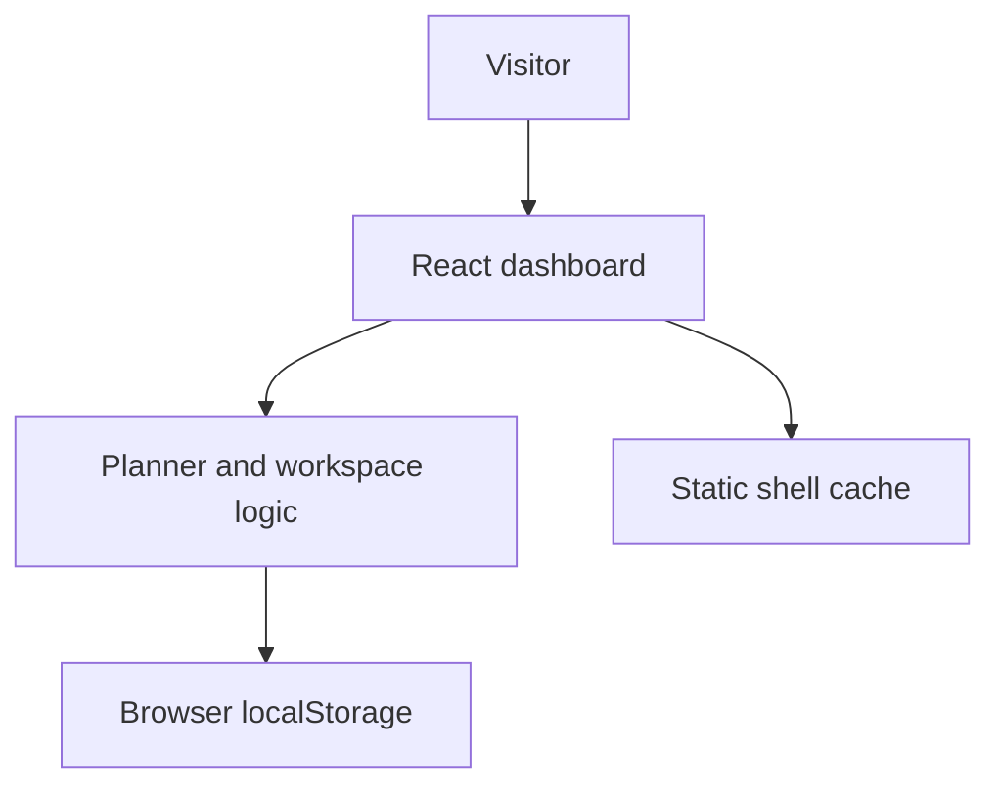
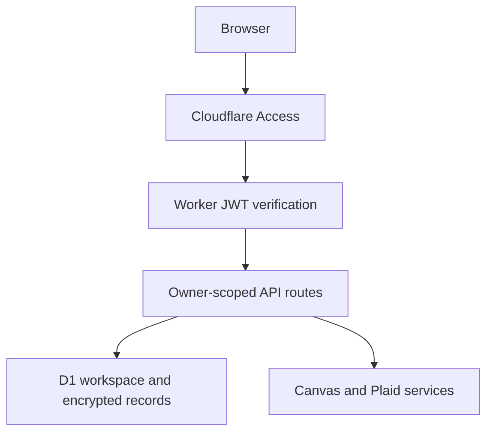

# Architecture

## Public demo

The active entry point is `demo/main.tsx`, with shared UI in `components/` and workspace types in `lib/workspace.ts`. Edits update React state immediately and are saved to `gerardo-os-demo-v1-workspace`. The demo does not read the original app's storage key.

The demo's integration components explicitly render disabled states. They do not import the original live clients. Static project cards replace GitHub API requests. No private API server is started by the demo commands.

`public/sw.js` caches same-origin static GET requests and excludes `/api/` paths. Cache cleanup only targets this demo's cache prefix. This is app-shell caching, not a cloud synchronization queue. First-time offline access requires a previous successful online load; browser offline behavior still needs dedicated validation.

## Private-app reference

This second diagram describes the retained implementation, not services enabled in this demo. Spotify's PKCE client flow is separate from the server-side Canvas/Plaid routes.

The Worker removes the browser-supplied identity header and verifies the Access JWT's issuer, audience, and algorithm before forwarding an authenticated owner identity. Missing verification configuration fails closed. API handlers check ownership and reject cross-site writes. Integration storage uses owner-scoped records, encryption, and compare-and-swap to avoid overwriting concurrent updates.

These controls are visible in source and partly covered by mocked tests. This is not an independent security audit or evidence that every production configuration has been verified.

## Source map

| Path | Purpose |
| --- | --- |
| `demo/`, `index.html`, `vite.config.ts` | Static demo entry and build |
| `components/dashboard-app.tsx` | Views, local edits, timer, sample demo boundary |
| `components/next-move-planner.tsx`, `lib/planner.ts` | Suggestions, completion and undo |
| `lib/workspace.ts` | Types and fictional fixtures |
| `components/second-brain-inbox.tsx` | Capture workflow |
| `reference/integrations/` | Original integration UI, excluded from demo bundle |
| `app/api/`, `lib/server/`, `db/`, `worker/` | Private server implementation reference |
| `tests/`, `scripts/test-integrations.mjs` | Mocked offline regression tests |

## Data boundaries

- All starter data is fictional. Inputs affect this browser's demo only.
- No credentials or private calendar feed input is offered in the demo.
- The manifest, service-worker cache prefix, and workspace key identify the demo separately.
- No original Git history or production D1/Access identifiers are included.
- A public static build contains client code. Its browser storage is not an authenticated or encrypted cloud database.
